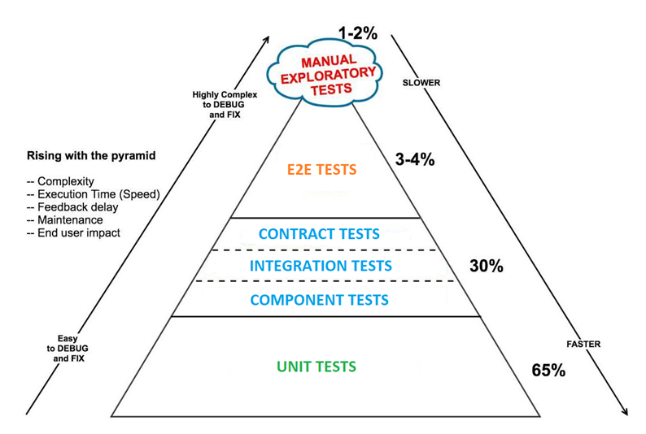

# Test Strategies for Microservices

This is a document to introduce test strategies for microservices, test pyramid, and different kinds of testing.

## Test Strategies

## Test Pyramid

## Unit Testing

Test a single method or class or a set of closely coupled classes, and speed is a very important factor.

### Solitary Unit Test

Focus on testing the unit in an isolated and controlled way.

### Social Unit Test

Focus on testing the behavior of the unit under test along with its dependencies and collaborators.

### Test Double

A generic term used when you replace a production object, usually a collaborator of the unit under test, with a simplified class double for testing purposes.

#### Dummy

A dummy object is passed but never used. It’s just used to fill required method parameters.

#### Fake

A fake object is an implementation of a collaborator, but it takes some shortcuts to make it more performant. A well-known example is the in-memory database.

#### Stub

A stub provides predefined answers to calls made during the test.

#### Mock

A mock is an object with preprogrammed expectations. An expectation can be a discrete value or an exception. Unlike stubs, mocks do runtime behavior verification. No state is stored.

#### Spy

A spy object is a stub that records information during the calls to it. For example, an email gateway stub might be able to return all the messages that it "sent".

## Component Testing

Verify the functionality of and between a microservice’s internal modules.

Need a good mixture of solitary and sociable tests to cover all the internal interactions of the microservice under test. 

Need doubles to replace interactions that would normally collaborate with external resources.

## Integration Testing

Check the interactions between different modules (or classes), usually belonging to the same subsystem, to verify that they collaborate as expected when providing a high-level feature. 

Check that all communication paths performed through the subsystem are correct.

## Contract Testing

Ensure the request sent and response received between provider and consumer conform to a shared understanding that is documented in Contract.

## End-to-End Testing

Verify that a system meets external requirements and achieves its goals, testing the entire system, from end to end.

### Vertical end-to-end tests

Test the depth of a feature presented by the application.

### Horizontal end-to-end tests

Test across the entire scope of an application.

## Reference

[Test Automation Strategy and Philosophy for Micro Services](https://www.codementor.io/@hemanthkandukuri/test-automation-strategy-and-philosophy-for-micro-services-vszdy6yvj)

[Testing Java Microservices](https://learning.oreilly.com/library/view/testing-java-microservices/9781617292897/)

